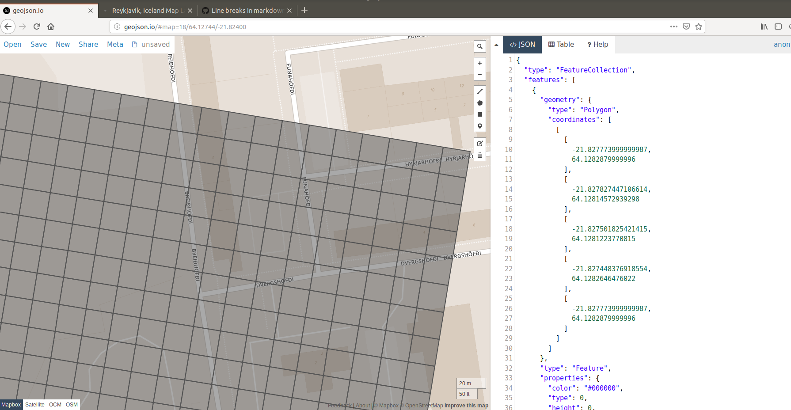

# city_io_to_geojson

## On the fly generation of projected CityIO grids 
Open the config.ini and enter your table specifications.
Execute _python city_io_to_geojson.py_ (Python 2.7).
Find resulting geojsons in the ./resulting_jsons folder.  
2 result sets will be generated  
a) ./resulting_jsons/outer_cells will contain the gridcells with coordinates of the true cell corners, using cellsize.  
b) ./resultings_jsons/inner_cells will contain 'inner' gridcells with margins towards the cells' centers.  
True gridcell sizes and locations will be maintained in any projection.

### Description of the tool
Generates a geojson containing a polygon for each gridcell of a CityScope table. 
The coordinates of the polygons can be generated in a desired projection / coordinate-reference-system, e.g. WGS 84.

The script generates an array of gridcells based on a origin point.
Gridsize is specified by the number of columns and rows given in the config.ini

The script will convert the origin point coordinates into a local metric coordinate reference system. 
First it will generate a metric local version of the grid and save it as geojson. 
The metric grid is then reprojected into the desired output coordinate reference system. 
Dimensions of the gridcells will stay true in output projection.
Resulting geojsons will be saved to the ./resulting_jsons folder

This script is used for providing an initial georeferenced version of the CityScope table at deploy. 
The geojson is containing only the coordinates and nulled properties for each gridcell. 
Properties can for each gridcell shall be updated through cityIO.

### Set your parameters in the config.ini
#### *[SETTINGS]*  
_ORIGIN_EPSG_: Coordinate reference system of ORIGIN_LONGITUDE AND ORIGIN_LATITUDE  
_LOCAL_EPSG_ = Local metric coordinate reference system, e.g. Hamburg 'EPSG:25832' 
    - Find your local EPSG here : https://epsg.io   
_OUTPUT_EPSG_ = Desired output coordinate reference system, e.g. 'EPSG:4326' for worldwide longitude, latitude

#### *[CITY_SCOPE]*  
_TABLE_FLIPPED_: yes|no
  - The table origin should be in the NorthWest corner of the table. In case the table is flipped,
and the origin specified is in the SouthWest corner, specify a 'yes' here. Default: no  

_TABLE_ROTATION_: The rotation of the table in degrees  
_CELL_SIZE_: Size of the gridcell in meters  
_ORIGIN_LONGITUDE_: Longitude of the table origin  
_ORIGIN_LATITUDE_:  Latitude of the table origin  
_TABLE_ROWS_: Count of rows on table  
_TABLE_COLS_: Count of columns on table  

### Examples of generated results
#### Nairobi

#### Reykjavik

#### Hamburg

#### Hamburg with cell margins 

